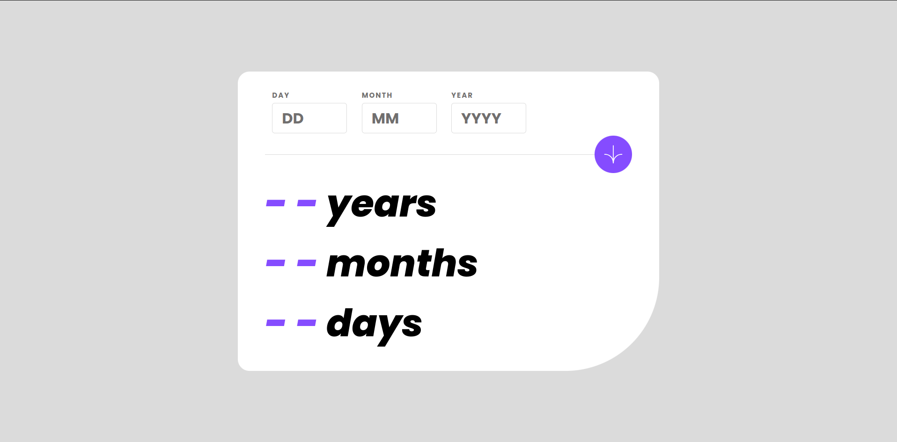
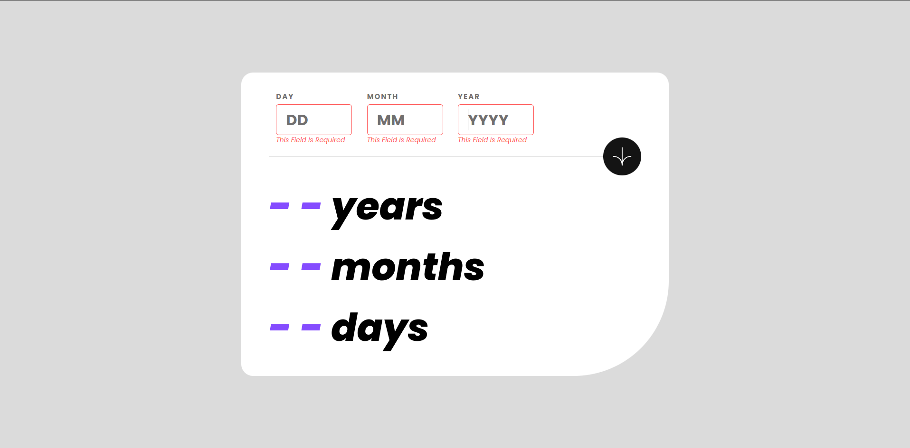
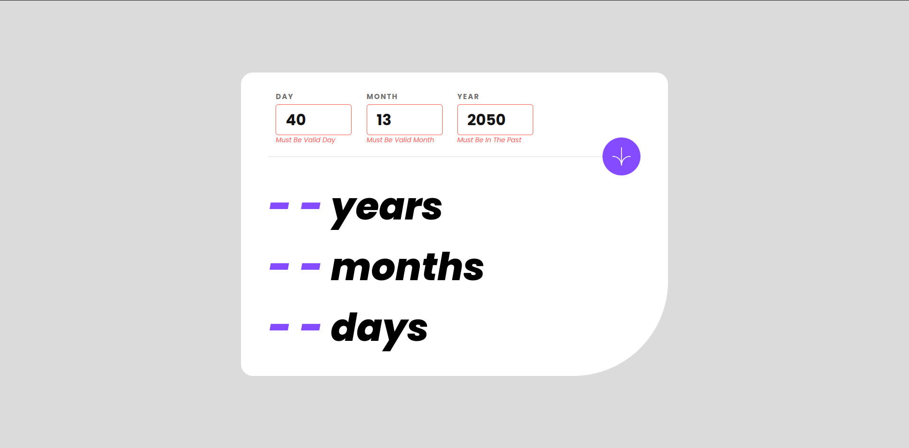
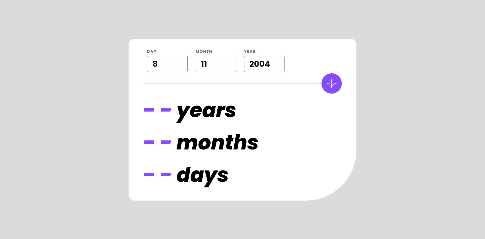
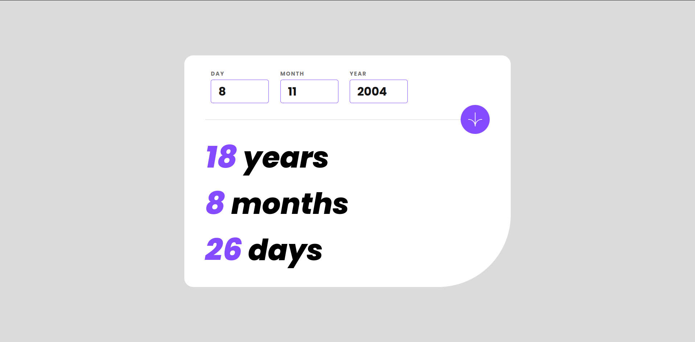
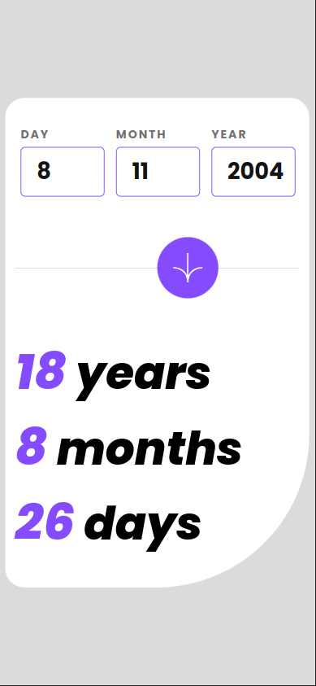

<h1>Age Calculator App</h1>
<h2>The Age calculator app is a web-based application that allows users to calculate their age based on their date of birth. The app was created using HTML, CSS, and JavaScript with Document Object Model (DOM) and Browser Object Model (BOM) manipulation.

The user interface of the Age calculator app is designed using HTML and CSS, which provides an intuitive and user-friendly layout for the users. The JavaScript code is used to manipulate the DOM, which allows the app to dynamically update and display the results of the age calculation without the need to refresh the page.</h2>

<h3>Live Demo: https://mohamed-0-turki.github.io/Age_Calculator_App/</h3>

<h4>Design</h4>

